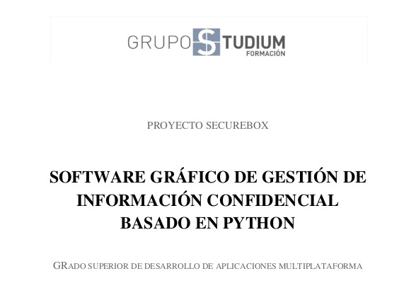
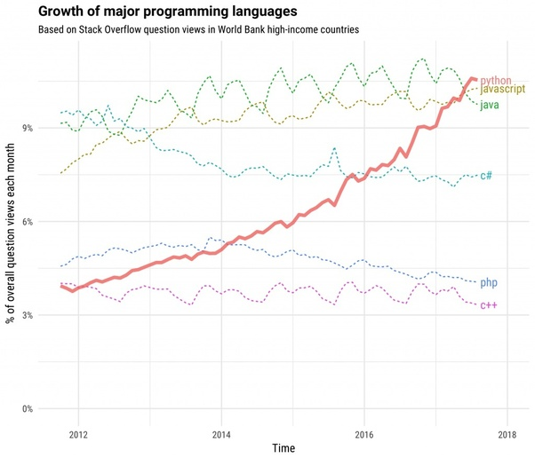
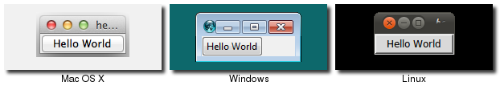

# 1. Estudio preliminar del problema

## 1.1. Descripción preliminar del sistema

El presente documento detalla la el desarrollo del proyecto denominado Securebox, realizado como proyecto integrado para la obtención del título de Técnico en Desarrollo de Aplicaciones Multiplataforma por parte del centro Grupo Studium, Sevilla. 

El objetivo del proyecto consiste en desarrollar un software multiplataforma que permita la gestión y almacenamiento de información de forma confidencial utilizando criptografía, garantizando principalmente la confidencialidad y la integridad de la información utilizando criptografía. 

El software desarrollado soportará la gestión de usuarios, pudiendo existir varios usuarios en la misma base de datos, siendo cada uno de ellos propietario de diferentes secretos. 

Securebox contará además con una interfaz gráfica que permita al usuario final realizar sus acciones de forma visual y cómoda. 

## 1.2. Funcionalidades básicas

### 1.2.1. Control de acceso

El software almacena usuarios y contraseñas para realizar su función. Es una función indispensable en el sistema, ya que cada fichero e información irá vinculada directamente al usuario. Securebox es multiusuario, en un equipo podrá haber varios usuarios pero sólo uno mantendrá una sesión iniciada. A su vez, el sistema permite la creación de usuarios. 

### 1.2.2. Gestión de información secreta

El núcleo lógico de Securebox es la gestión de información secreta. Esta se almacenará en la base de datos junto a diferentes metadatos que permitan el correcto desempeño de la aplicación. Podemos clasificar la información secreta en archivos y cadenas de texto.

Los archivos son ficheros de cualquier tipo y extensión. Pueden ser imágenes, documentos, ficheros de texto, audio, vídeo, etc. Estos se almacenarán en el sistema.

Al igual que los archivos, las cadenas de texto permiten la gestión de información introducida directamente por parte del usuario iniciado, de forma que pueda almacenar de forma segura mensajes secretos, contraseñas, pins, etc.

## 1.3. Viabilidad del sistema

El lenguaje de programación orientado a objetos Python, utilizado como base del sistema, crece en cuota de mercado a gran velocidad. Estimándose como uno de los lenguajes más utilizados en el futuro próximo de la tecnología, lo que asegura un continuo soporte y comunidad. Estos factores favorecen un amplio periodo en la línea temporal en el que esta aplicación podrá ser utilizada sin quedar obsoleta, algo a tener en cuenta en un mundo tecnológico tan mutable.



Python se encuentra, de hecho, en uso constante en aplicaciones para la ciberseguridad, tratamiento de datos masivos, implementando con grandes resultado en el análisis de Big Data y minería de datos, programación científica y data science y, últimamente, implementando materia de IA (Inteligencia Artificial), Machine Learning, Deep Learning, etc.


Para situar al lector, podemos observar aplicaciones conocidas que implementan, de una forma u otra, el lenguaje de programación Python; empresas y organizaciones científicas con tan amplio volumen y flujos de información como NASA, Nmag Computational Micromagnetic, National Geographic; grandes periódicos y mass media como The Washington Post, The New York Time o grandes redes sociales con miles de millones de usuarios como Instagram y Pinterest.

Además, la planificación de aplicaciones aplicadas a la seguridad de la información no deja de incrementarse en el tiempo; debido en gran parte a los numerosos escándalos de graves fallos de seguridad, filtraciones de datos sensibles, espionaje informático, el crecimiento del malware, estafas online, etc. La sociedad, hoy, tiene más conciencia de protección de su información cuando trabaja con tecnologías informáticas.

Por estas razones, podemos concluir que, tras el análisis de viabilidad del proyecto, este cumple las condiciones para considerarse viable y robusto en cuanto a su desarrollo y mantenimiento en el tiempo.

## 1.4. Estimación del coste del sistema

### 1.4.1. Recursos humanos

El software ha sido realizado hasta la versión beta únicamente por el autor del presente documento. El desarrollo podría ampliarse, asignando programadores a las tres categorías que conforman, de forma lógica, la estructura del proyecto: frontend, backend y lógica matemática.

Tras un estudio de estimación temporal aplicado al sistema, se ha establecido, en materia de duración temporal, lo siguiente:

|                                                              | Tiempo estimado (en circunstancias normales) |
| ------------------------------------------------------------ | -------------------------------------------- |
| Diseño de base de datos y lógica de aplicación               | ½ semana                                     |
| Diseño y moqueo de interfaz gráfica y funcionalidades del sistema | ½ semana                                     |
| Implementación de base de datos en código de aplicación      | 1 semana                                     |
| Desarrollo de ventana principal de interfaz gráfica          | ½ semana                                     |
| Desarrollo de diálogos y ventanas secundarias en interfaz gráfica | ½ semana                                     |
| Diseño, desarrollo e implementación de matemática del sistema y algoritmos criptográficos | 1-2 semanas                                  |
| Plan de pruebas y ciberseguridad                             | 1 semana                                     |
| Documentación                                                | 1 semana                                     |

A pesar de los datos ofrecidos, la tecnología utilizada no es la tecnología dominada por el programador del proyecto, siendo el autor del presente documento, a pesar de tratarse de una tecnología idónea para el mismo. Por esta razón, es posible que los tiempos estimados se incrementen favoreciendo la investigación, aprendizaje autodidacta y resolución de problemas desconocidos hasta la fecha por el autor.

### 1.4.2. Recursos hardware

No son necesarios recursos hardware específicos para soportar el sistema en cuestión. Este no tendría problemas en ejecutarse en equipos de diferentes arquitecturas y con variados recursos.

Durante el desarrollo, se utilizará un ordenador portátil VantPC con un procesador i7-8550u 1.8GHz (Intel Core 8ª Generación) con una memoria de 16GB DDR4. El sistema será a su vez probado en otros equipos de bajos recursos, tanto con arquitectura de x64 y x32. Existen pruebas planificadas sobre ARM.

### 1.4.3. Recursos software

Securebox ha sido diseñado con tecnología multiplataforma Python 3.6 y la interfaz gráfica propia de Tkinter y TTK, una librería del mismo lenguaje. Python es un lenguaje multiplataforma que puede ser ejecutado en casi cualquier sistema operativo y arquitectura de procesador que existe -al menos utilizado comúnmente-, pudiendo ser ejecutado en sistemas GNU/Linux, Microsoft Windows, Mac OS X, FreeBSD, etc.

Tkinter a su vez permite funciona correctamente en los tres grandes sistemas operativos: GNU/Linux, Microsoft Windows y Mac OS X de forma eficiente y óptima. Esto se debe a que Tkinter utiliza el potencial lógico y gráfico de cada sistema para dibujar la interfaz. Adaptándose automáticamente al entorno tanto lógica como visualmente, ofreciendo así un sistema adaptado y multiplataforma, así como integrado visualmente en el entorno.



No obstante, Securebox ha sido desarrollado en un sistema GNU/Linux en su distribución Arch Linux. Aprovechando así el potencial del sistema operativo y su magnífica integración con el lenguaje Python para realizar un desarrollo cómodo y eficaz. 

Ha sido desarrollado utilizando el entorno de desarrollo profesional de PyCharm. Un entorno de Jetbrains completo y diseñado específicamente para el desarrollo con este lenguaje. La elección de este entorno proviene de su simplicidad y sencillez de uso, además de una buena gestión de errores y librerías externas (aunque la mayor parte de esas virtudes provienen de Python más que de PyCharm). A pesar de ello es posible integrar su desarrollo sin ningún problema con otros entornos especializados como Ninja IDE y otros como Eclipse con su plugin de Python.

### 1.4.4. Coste estimado

El sistema operativo de desarrollo es GNU/Linux, el cual es software libre y completamente gratuito. Python es a su vez gratuito. Por lo que la implementación del software en un entorno real, a parte del posible tiempo y trabajo humano (sumado a soportes, integraciones, desarrollo de funcionalidades extra, etc) sería completamente gratuito.

Dependiendo del modelo de desarrollo, podría suponer algún coste. Por ejemplo mediante el uso de software especializado, entornos de desarrollo de pago, soporte, etc.

Como podemos ver, el desarrollo e implementación ofrece la posibilidad de ahorrar todo tipo de costes informáticos y técnicos, dando importancia al coste humano de tiempo, trabajo, soporte y mantenimiento. Algo atractivo para el cliente y el desarrollador.

# 2. Análisis y diseño de la aplicación

## 2.1. Datos

Securebox requiere del uso de bases de datos para realizar correctamente su funcionamiento, ya que el núcleo del sistema lo conforman estos datos alojados en la misma. En el presente apartado se realizará un estudio y análisis de la estructura de los datos, así como sus relaciones y su implementación.

### 2.1.1. Esquema Entidad - Relación

A continuación vemos el esquema relacional del sistema. Éste muestra el sistema organizativo de los datos relacionados entre sí. Se trata de un sistema sencillo: dos tablas con una sola relación entre ellas, que controla el sistema de propietarios de los diferentes elementos secretos. Un propietario puede tener ó 0 ó N (ninguno o muchos) secretos mientras que un secreto requiere obligatoriamente de un solo propietario. La definición de cada elemento será expuesta más adelante.


### 2.1.2. Traslado a un esquema relacional

Estos datos los clasificaremos en dos tablas, que corresponden a la gestión de usuarios y a la gestión de objetos secretos que cada usuario manipula mediante la aplicación.

| users   | *id, name, hash                                              |
| ------- | ------------------------------------------------------------ |
| secrets | *id, name, algorithm, property, hash, version, validation, cryptedpassword, cryptedinfo, cryptedfile, site, mail, username, notes |

### 2.1.3. Elección justificada de un sistema gestor de base de datos concreto

Tras un estudio preliminar del sistema, se ha llegado a la conclusión de la utilización de una base de datos relacional, debido a las ventajas que ofrece en este caso sobre las bases de datos no relacionales: la principal ventaja que ofrece las bases de datos no relacionales (o NoSQL) es la eficiencia y versatilidad a la hora de manejar grandes cúmulos de información. Ventaja que, en este proyecto no se vería afectada; pues no esta pensado para mover grandes cantidades de información.

Dentro de las bases de datos relacionales, existen diferentes gestores. Los dos gestores principales, en los que se ha estudiado la posibilidad de implantación en el sistema son PostgresQL y MySQL/MariaDB.

Ambos son gestores de software libre, con gran usabilidad y un diseño similar. PostgresQL ofrece una serie de ventajas con el lenguaje de programación orientado a objetos utilizado: Python. A pesar de ello, la cuota de mercado de MySQL es muy superior a PostgresQL y es mucho más sencillo encontrar equipos y servidores con MySQL instalado. Algo que vendría muy bien a la hora de escalar la aplicación e implementar la gestión remota.

De modo que finalmente se ha optado por la utilización teórica de MySQL/MariaDB. Aunque, en la práctica, el sistema podrá, con mínimos cambios, soportar ambos gestores. Algo que se trata de una mejora futura para el sistema.

### 2.1.4. Traslado a un esquema físico relacional

A continuación es mostrado el esquema físico relacional, extraído directamente de la base de datos creada.


### 2.1.5. Restricciones no implementables en el modelo de datos que deberá contemplar la aplicación

Securebox utiliza archivos binarios BLOB, MEDIUMBLOB y LONGBLOB, por lo que es muy posible que el servidor de la base de datos deba ser configurado para permitir la trasmisión de información modelo-controlador superior a los límites establecidos, ya que a menudo pueden superar dicho límite estos archivos binarios.

En la realización de pruebas durante el desarrollo hubo que ampliar innodb_log_file_size a 1GB de almacenamiento. También hubo ser configurados el tamaño máximo de paquete permitido. Esta configuración dependerá del servidor utilizado y de las necesidades del cliente, por lo que no es posible asegurar una configuración exacta necesaria para su correcto funcionamiento.

Adjunto configuración en desarrollo del servidor MariaDB utilizado en el archivo de configuración my.cnf. Este archivo es válido también para un servidor MySQL. 

```bash
# The MariaDB server
[mysqld]
bind-address = 127.0.0.1
port = 3306
socket = /run/mysqld/mysqld.sock
skip-external-locking
key_buffer_size = 16M
max_allowed_packet = 128M
table_open_cache = 64
sort_buffer_size = 512K
net_buffer_length = 8K
read_buffer_size = 256K
read_rnd_buffer_size = 512K
myisam_sort_buffer_size = 8M
innodb_log_file_size=1024M
```

En caso de requerir un servidor de base de datos remoto será necesario configurarlo para permitir conexiones remotas.

## 2.2. Funciones

### 2.2.1. Diagrama de flujo de datos

Para facilitar la compresión del sistema, se expondrán diferentes diagramas relacionados, de forma que el lector pueda estudiar cada uno de ellos de forma detallada.

Al iniciar el programa, el usuario tiene dos opciones. Iniciar sesión con una cuenta existente o crear una nueva cuenta de usuario. La creación de una nueva cuenta requerirá de la entrada de datos manual por parte del mismo. Una vez introducidos y aceptados los diferentes datos, estos se insertarán en la base de datos. Existe la posibilidad de ejecutar un proceso que genera contraseñas según diferentes parámetros, que podremos llamar en el momento de la creación del usuario.

En caso de iniciar sesión, será también necesaria la introducción de datos de forma manual por parte del usuario. Una vez introducidos y aceptados los datos, se realizará una consulta a la base de datos que ejecutará un proceso que comprobará los datos y, concretamente, el hash del mismo. En caso de devolver un valor verdadero, es decir, el usuario y la contraseña son válidos, se creará un objeto de sesión que almacenará, como su nombre bien indica, la sesión de usuario iniciada. En caso de devolver un valor falso, se pedirá de nuevo los datos de entrada.

Una vez finalizado el inicio de sesión y creado el objeto sesion, el programa será iniciado.


Una vez iniciada la sesión y creado el objeto sesion, se procederá a partir de la información facilitada en dicho objeto, a la carga de la tabla. Tanto los componentes gráficos de la misma como los elementos que la conforman, extraídos directamente de la base de datos mediante consulta a la tabla secrets. Posteriormente se iniciará la carga de botones, los cuales se dispondrán gráficamente y se cargarán sus determinadas funciones. Una vez se ejecute una acción sobre los mismos, se realizará una recarga de tabla para actualizar los datos mostrados de forma automática.

 


 

El siguiente paso será actuar sobre la información expuesta en la tabla. Podemos observar cinco botones diferentes, cada uno de los cuales realizará una opción diferente.

1. Cifrar. Al ejecutar la función de cifrar el usuario deberá introducir manualmente los datos no cifrados y posteriormente los datos para cifrar. El sistema comprobará si en estos últimos el usuario requiere un archivo adjunto, en caso verdadero será obtenido del disco duro. Posteriormente los datos serán cifrados e insertados en la base de datos.
2. Descifrar. El sistema realizará una consulta a la base de datos obteniendo los datos cifrados requeridos por el usuario. Los datos se mostrarán por pantalla ya descifrados. En caso de existir un archivo adjunto en el objeto, se creará en el disco duro.
3. Actualizar. El proceso de actualización consiste en la modificación de un elemento ya existente. Simplemente el usuario actualiza manualmente los campos de dicho elemento, conocidos por el sistema obteniéndose de la base de datos y este será actualizado posteriormente en la misma.
4. Eliminar. Obteniendo el elemento deseado, este será enviado a la base de datos con el propósito de realizar una eliminación del mismo.


Sin entrar a analizar el algoritmo de cifrado AES que utiliza Securebox, puesto que no es la competencia ni función de este documento, observaremos el proceso general que realiza el sistema para cifrar y descifrar un elemento. Ambas funciones son muy similares, pero a la inversa, puesto que el cifrado utilizado corresponde a un tipo de criptografía simétrica, utilizando la misma clave tanto para cifrar como para descifrar. La razón de la utilización de este modo respecto a la criptografía asimétrica de claves pública y privada se expondrán más adelante en el documento. 

Primero, necesitamos una clave, que se utilizará tanto para cifrar como para descifrar la información.

- Cifrado. Una vez obtenida esta clave, se obtendrá la información que se cifrará. El algoritmo AES en su modo CBC requiere que esta información sea de una longitud de 16 o múltiplo de 16. Por lo tanto, esta información será transformada, en el momento de cifrar, en múltiplo de 16. Después el encryptor propio del lenguaje, mediante el modo y el IV seleccionados, cifrará la información, retornándola.
- Descifrado. En cuanto al descifrado, una vez obtenida la clave (la misma del cifrado, si no, no descifrará correctamente) y recibida la información cifrada, se pasará al decryptor propio de Python, al igual que en el cifrado, mediante el modo y el IV (ambos también similares) descifrarán la información. Una vez descifrada ésta, se invertirá el paso a múltiplo de 16 mediante el cálculo inverso, obteniendo de esta manera la información tal y como fue cifrada.


